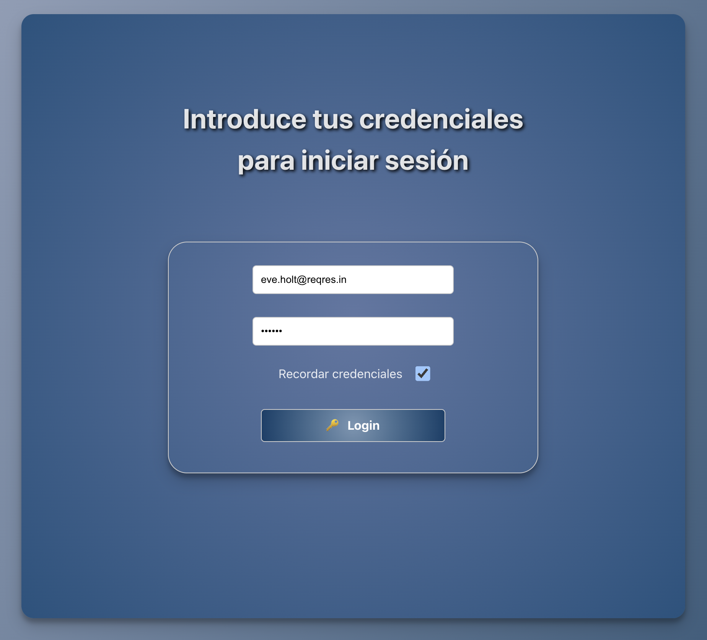
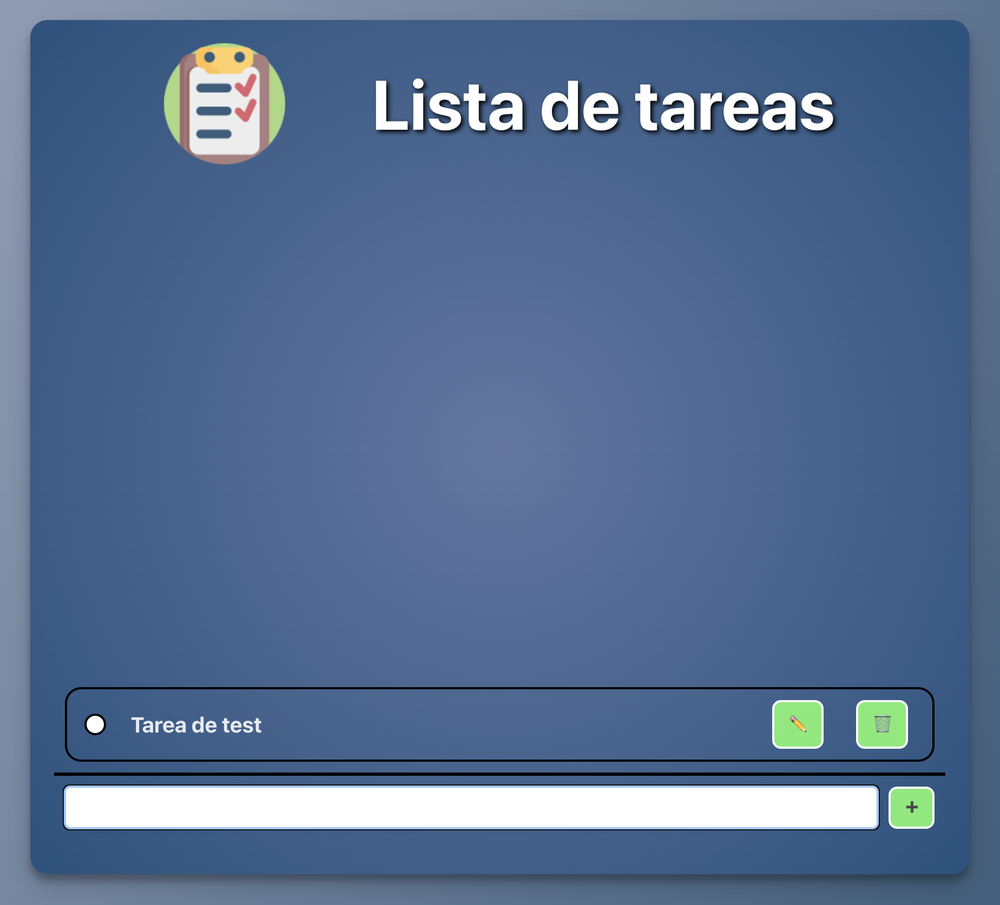

# ✅ ToDo List con Login (React)

Aplicación web desarrollada en React que permite iniciar sesión mediante una API externa y gestionar una lista de tareas personalizada. Fue creada como proyecto práctico durante el máster para reforzar conceptos clave de React como hooks, manejo de estado, control de formularios, almacenamiento local y componentes reutilizables.

---

## 🔐 Autenticación

La app utiliza la API pública de [Reqres](https://reqres.in/) para validar usuarios. Una vez autenticado, el usuario accede a una interfaz donde puede gestionar sus tareas.

Incluye un **checkbox "Recordar credenciales"** que, si se activa, guarda el email y password en `localStorage` para precargar el formulario en futuros accesos (mejorando la experiencia de usuario).

---

## 🧩 Funcionalidades principales

- 🔐 **Login** con validación usando Reqres API  
- 🧠 **Recordar credenciales** usando `localStorage`
- ➕ **Agregar tareas**  
- ✅ **Marcar como completadas**  
- ✏️ **Editar tareas** (solo si no están completadas)  
- 🗑️ **Eliminar tareas**

---

## 🛠️ Tecnologías utilizadas

### Frontend:
- React
- React Hooks (`useState`, `useEffect`)
- HTML / CSS
- localStorage

### API externa:
- [Reqres](https://reqres.in/) – simulación de autenticación

---

## 🚀 Demo

🔗 [Ver la demo en Vercel](https://todolist-demo.vercel.app) <!-- Cambia este enlace si tienes uno real -->  
📂 [Ver el repositorio en GitHub](https://github.com/tuusuario/todo-list-login)

---

## 🧪 Cómo ejecutarlo localmente

1. Clona este repositorio:
```bash
git clone https://github.com/tuusuario/todo-list-login.git
cd todo-list-login
```

2. Instala las dependencias:
```bash
npm install
```

3. Inicia el proyecto:
```bash
npm run dev
```

4. Abre tu navegador en:
```bash
http://localhost:5173
```
## 🧠 Notas adicionales
📌 **El login funciona con usuarios de prueba disponibles en Reqres,** por ejemplo:
```bash
Email: eve.holt@reqres.in
Password: pistol
```

- Las tareas no se almacenan en una base de datos externa, por lo que no persisten tras cerrar la pestaña.
- Las credenciales se guardan en `localStorage` **solo si el usuario activa el checkbox de "Recordar credenciales".**

## 📸 Capturas de pantalla
#### 📷 Pantalla de login



#### ✅ Lista de tareas



## 📩 Contacto

¿Te gustaría contactarme para colaborar o conocer más sobre el proyecto?

📧 ivanloav@gmail.com
🔗 [LinkedIn](https://www.linkedin.com/in/ivanloav)

## 📄 Licencia

Este proyecto fue desarrollado con fines educativos como parte de mi formación como desarrollador.
Puedes usarlo y adaptarlo libremente bajo la licencia MIT.